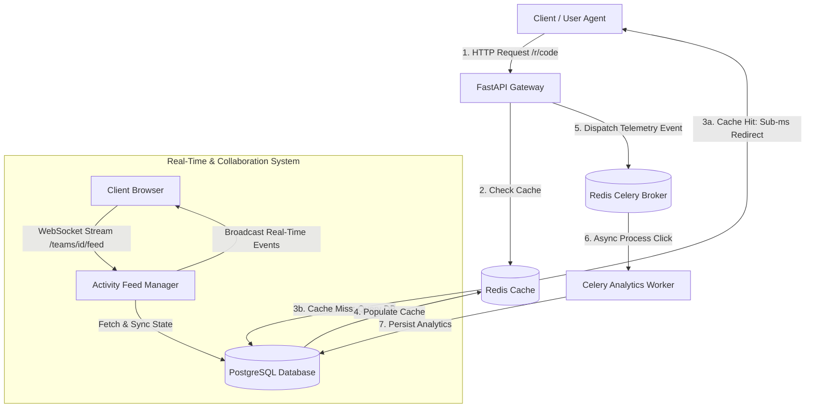

# Production-Grade URL Shortener & Collaborative Analytics Platform

[](https://www.python.org/)
[](https://fastapi.tiangolo.com/)
[](https://www.postgresql.org/)
[](https://redis.io/)
[](https://www.docker.com/)
[]()

A URL shortening and analytics platform built with FastAPI, PostgreSQL, Redis, and Celery, featuring low-latency URL redirection, asynchronous click analytics, real-time WebSocket updates, and role-based access control (RBAC).

---

## 🏗️ System Architecture



---

## ✨ Key Features

- **Low-Latency Redirections**: Read-through Redis caching reduces database lookups for frequently accessed URLs.
- **🔄 Asynchronous Telemetry Pipeline**: Celery worker integration offloads analytics processing (IP lookup, user-agent parsing, click metrics) from the critical redirect path.
- 🛡️ **Distributed Rate Limiting**: Redis-backed sliding-window rate limiting helps control excessive requests and API abuse (HTTP 429).
- **👥 Multi-Tenant Team Collaboration**: Granular Role-Based Access Control (RBAC: `Owner`, `Admin`, `Member`, `Viewer`) supporting target-generic `CommentThread` discussions and tokenized team invitations.
- **📡 Real-Time WebSockets Feed**: Stateful connection manager delivering real-time activity updates to team channels (`/teams/{team_id}/feed`).
- 🔐 **Security Controls**: Centralized middleware and validation for authorization, SQL injection prevention, and request parameter validation.
- **📊 Observability & Health Probes**: Prometheus `/metrics` endpoint, coupled with Kubernetes `/health` (liveness) and `/ready` (readiness) probes verifying DB and Redis connectivity.

---

## 🛠️ Technology Stack

| Layer | Technology |
| :--- | :--- |
| **Framework** | FastAPI (ASGI), Uvicorn |
| **Language** | Python 3.10+ |
| **Database & ORM** | PostgreSQL 15, SQLAlchemy 2.0, Alembic |
| **Caching & Rate Limiting** | Redis 7 |
| **Task Queue** | Celery + Redis Broker |
| **Real-Time Communications** | WebSockets |
| **Validation & Settings** | Pydantic v2, Pydantic-Settings |
| **Testing & Mocking** | Pytest, TestClient, Pytest-Cov |
| **Containerization & CI/CD** | Docker, Docker Compose, Kubernetes, Helm, GitHub Actions |
| **Monitoring** | Prometheus Client, Custom JSON Loggers |

---

## 📂 Project Structure

```text
.
├── app/
│   ├── config.py             # Pydantic environment configuration
│   ├── dependencies.py       # Auth dependencies & Rate Limiter
│   ├── metrics.py            # Prometheus metrics & memory gauges
│   ├── celery_app.py         # Celery broker configuration
│   ├── tasks.py              # Asynchronous analytics task definitions
│   ├── routers/              # Modular API Routers
│   │   ├── activity.py       # WebSocket real-time activity feed
│   │   ├── comments.py       # Discussion threads & comments API
│   │   ├── links.py          # Short link CRUD management (v1)
│   │   ├── links_v2.py       # Enhanced link management (v2)
│   │   ├── notifications.py  # Mentions & unread notification endpoints
│   │   ├── redirect.py       # Core fast-path URL redirection router
│   │   ├── teams.py          # Team CRUD & RBAC membership management
│   │   └── webhooks.py       # Event webhook registrations
│   ├── schemas/              # Pydantic validation schemas
│   └── services/             # Core business logic services
│       ├── activity_feed.py  # WebSocket connection manager
│       ├── cache_service.py  # Redis read-through cache service
│       ├── mention_service.py# Mention extractor & notification service
│       └── resilience.py     # Circuit breaker & retry handlers
├── docs/                     # Documentation & System Architecture Docs
│   ├── event-pipeline-design-doc.md # Pipeline architecture design
│   ├── rate-limiting-design-doc.md  # Rate limiting architecture design
│   ├── security_findings.md        # Security audit findings
│   ├── failure_modes.md            # Failure mode analysis
│   ├── postmortem.md               # Production incident postmortem
│   ├── rollback_plan.md            # Deployment rollback plan
│   └── runbooks/                   # Operational Triage Runbooks
├── tests/                    # Automated Integration & Unit Tests
├── main.py                   # FastAPI entrypoint, middleware & exception handlers
├── models.py                 # SQLAlchemy declarative base models
├── database.py               # Database engine & session management
├── Dockerfile                # Multi-stage production container build
├── docker-compose.yml        # Multi-service stack composition
└── requirements.txt          # Production dependencies
```

---

## 🌐 API Endpoints Reference

### Core Redirect & Public Routes
| Method | Endpoint | Description |
| :--- | :--- | :--- |
| `GET` | `/health` | Liveness probe (returns `200 OK`) |
| `GET` | `/ready` | Readiness probe (checks PostgreSQL & Redis connection health) |
| `GET` | `/metrics` | Prometheus metrics scrape endpoint |
| `GET` | `/r/{code}` | **Core Fast-Path Redirect** (Resolves short code to destination URL) |

### Link Management (`/v1/links` & `/v2/links`)
| Method | Endpoint | Description |
| :--- | :--- | :--- |
| `POST` | `/v1/links/` | Create a new short URL link |
| `GET` | `/v1/links/` | List all links (Paginated) |
| `GET` | `/v1/links/{link_id}` | Fetch link details by ID |
| `PATCH` | `/v1/links/{link_id}` | Update destination URL or metadata |
| `DELETE` | `/v1/links/{link_id}` | Delete a short link (invalidates cache) |
| `POST` | `/v1/links/bulk` | Bulk create short URLs |
| `GET` | `/v1/links/{link_id}/analytics` | Fetch click analytics and timeseries data |

### Teams & Real-Time Collaboration
| Method | Endpoint | Description |
| :--- | :--- | :--- |
| `POST` | `/teams/` | Create a new enterprise team |
| `POST` | `/teams/{team_id}/members` | Add user to team with specified role |
| `WS` | `/teams/{team_id}/feed` | Real-time WebSocket activity feed stream |
| `POST` | `/threads/` | Create a comment thread linked to a resource |
| `POST` | `/threads/{thread_id}/comments` | Add comment to thread (with user mentions `@user`) |
| `GET` | `/notifications/` | List unread user notifications |

---

## 🚀 Getting Started

### Prerequisites
- Python 3.10+
- PostgreSQL 15+
- Redis 7+
- Docker & Docker Compose (Optional)

### Local Environment Setup

1. **Clone the repository:**
   ```bash
   git clone https://github.com/samaspoorthireddy/production-url-shortener.git
   cd production-url-shortener
   ```

2. **Create and activate a virtual environment:**
   ```bash
   python -m venv venv
   source venv/bin/activate  # On Windows: venv\Scripts\activate
   ```

3. **Install dependencies:**
   ```bash
   pip install -r requirements.txt
   ```

4. **Configure environment variables:**
   ```bash
   cp .env.example .env
   ```

5. **Start the FastAPI server:**
   ```bash
   uvicorn main:app --reload --port 8000
   ```
   Access interactive API docs at `http://localhost:8000/docs`.

---

## 🐳 Running with Docker

Start the complete infrastructure stack (FastAPI, PostgreSQL, Redis, Celery worker) with a single command:

```bash
docker-compose up --build
```

---

## 🧪 Testing & Verification

Run the automated test suite with coverage report:

```bash
pytest --cov=app --cov=models
```

---

## 👤 Author

**Spoorthi Reddy Sama**  
- **GitHub:** [@samaspoorthireddy](https://github.com/samaspoorthireddy)

---

## 📜 License

This project is licensed under the MIT License - see the [LICENSE](LICENSE) file for details.
